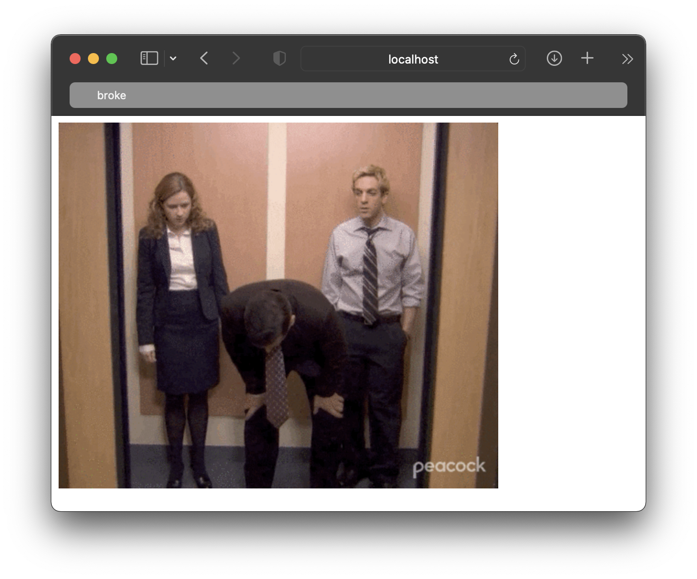
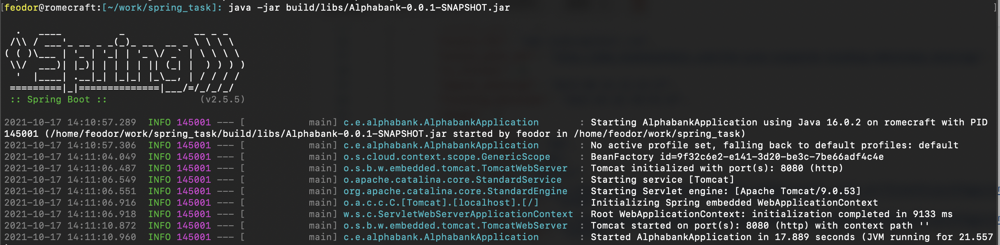
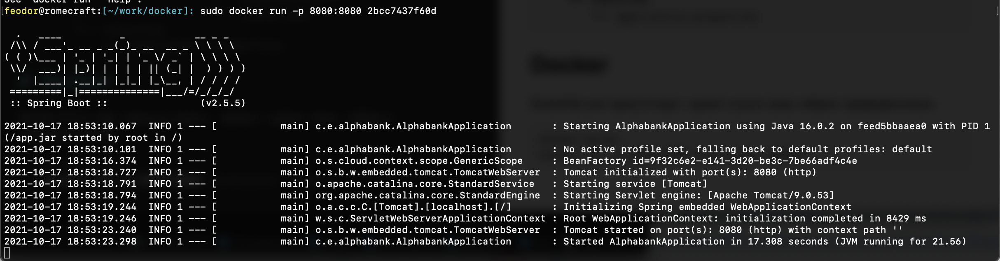

# Тестовое задание 

### Описание

Создать сервис, который обращается к сервису курсов валют, и отображает gif:
если курс по отношению к USD за сегодня стал выше вчерашнего, то отдаем рандомную [отсюда](https://giphy.com/search/rich)
если ниже - [отсюда](https://giphy.com/search/broke) 

### Ссылки

[REST API курсов валют](https://docs.openexchangerates.org/)

[REST API гифок](https://developers.giphy.com/docs/api#quick-start-guide)

## Must Have

* 	✅ Сервис на Spring Boot 2 + Java / Kotlin
* 	✅ Запросы приходят на HTTP endpoint (должен быть написан в соответствии с rest conventions), туда передается код валюты по отношению с которой сравнивается USD
* 	✅ Для взаимодействия с внешними сервисами используется Feign
* 	✅Все параметры (валюта по отношению к которой смотрится курс, адреса внешних сервисов и т.д.) вынесены в настройки
* 	✅На сервис написаны тесты (для мока внешних сервисов можно использовать @mockbean или WireMock)
* 	✅Для сборки должен использоваться Gradle
* 	✅Результатом выполнения должен быть репо на GitHub с инструкцией по запуску

## Nice to Have

* ✅Сборка и запуск Docker контейнера с этим сервисом
	
# Работа программы: 

## Установка

Проверить наличие jdk 11 или новее версии. Если отсутствует, установить в соответствии с операционной системой. 
 
	feodor@hostname:[~/work/]: java -version 
	javac 16.0.2

Скопировать репозиторий и перейти в него. 

	git clone https://github.com/feod0r/spring_task
	cd spring_task

## Запуск

Выполнить сразу:

	./gradlew bootRun 
	
Либо собрать продукт:

	./gradlew bootJar
	или 
	./gradlew build

Gradle в это время загрузит все библиотеки, скомпилирует классы и соберет jar файл. 
Запустить его:

	feodor@hostname:[~/work/spring_task]: java -jar build/libs/Alphabank-0.0.1-SNAPSHOT.jar 	

Сервис запущен на порту 8080. 

# Карта эндпоинтов

	/currency/oldValue/{coin}
	/currency/realValue/{coin}
	/giphy/{coin}
	
# Файловая структура проекта

	src
    └── main
        ├── java
        │   └── com
        │       └── example
        │           └── alphabank
        │               ├── AlphabankApplication.java
        │               ├── CurrencyController.java
        │               ├── GiphyController.java
        │               └── network
        │                   ├── Currency.java
        │                   ├── ExRate.java
        │                   ├── GiphyData.java
        │                   └── Giphy.java
        └── resources
            └── application.properties

# Docker

Dockerfile уже присутствует, проект нужно лишь собрать предварительно. 

	docker build .
	docker run -p 8080:8080 {container number}
	
